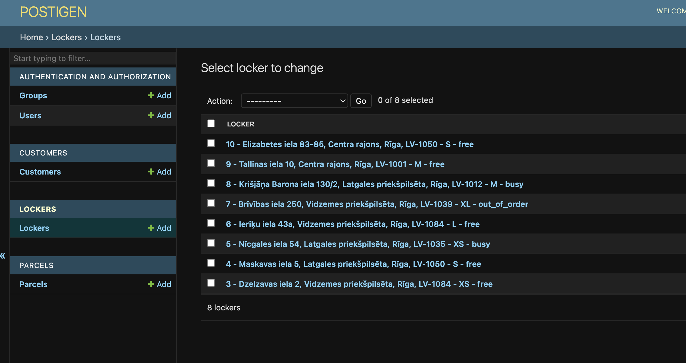

# POSTIGEN

## PROJECT

The Postigen is a simple parcel movement application API.
The front-end solution you can
find [here](https://github.com/VladislavB92/postigen-front/blob/main/postigen-front/README.md).

It allows:

- the user to create a parcel order with a sender and receiver;
- put the parcels in the locker;
- move the parcels between lockers;
- take out the parcel from the locker.

### CMS

The project has an active admin panel which is accessible via `admin/`.
All CRUD operations can be performed there.

### Endpoints

#### Parcels

- [GET/POST] `/api/parcels/` - list all parcels or create a parcel
- [GET/DELETE] `/api/parcel/:id/` - get or delete single parcel by its ID
- [PUT] `/api/parcels/:id/put-parcel/` - put parcel in specific locker referencing by its ID
- [PUT] `/api/parcels/:id/move-parcel/` - move parcel from one locker to another referencing by their IDs

### Lockers

- [GET/POST] `/api/lockers/` - list all lockers or create one
- [GET/DELTE] `/api/lockers/:id/` - get or delete single locker by its ID
- [PUT] `/api/lockers/:id/take-parcel/` - take out the parcel from the locker by referencing their ID
  as a parameter and body data

### Customers

- [GET/POST] `/api/customers/` - list all customers or create one
- [GET/DELETE] `api/customers/:id/` - get or delete single customer by its ID

## TECHNOLOGY

- The project is based on the `Python v3.11`, `Django v4.2.5` with `Django Rest Framework (DRF) v3.14.0`.
- For the data storage the project utilises `Postgres v15.4`.
- Postigen is dockerized, therefore, please ensure to have installed `Docker` on your machine.
- Tests are based on Pytest library.

## DEVELOPMENT

### Installation (MacOS/Linux)

#### Docker way (preferable):

1. Ensure that you have the latest Docker binaries installed on your computer.

2. Create and fill the `.local.env` configuration file with the appropriate values. Set up the database values as
   needed.

3. Run docker-compose to build the image and containers. Database will be created automatically.

        docker-compose up

5. See the containers running in Docker. Get the container's ID of the brainiac app, copy it.

        docker ps

6. Activate the bash terminal of the container

        docker exec -it <container_id> bash

7. Create a superuser for the CMS admin panel.

        python manage.py createsuperuser

8. The project comes with the fixture file which holds pre-made data for quicker testing which can be applied.

        django-admin loaddata fixtures/initial_data.json

#### Local way:

Even if you decide to install the project using the `Docker` way, it is advised to steps 3 and 4 from this section
for Django to recognize packages and their import across IDE.

1. Define the development environment in the terminal.

        export DJANGO_DEVELOPMENT=true

2. Create and fill the `.local.env` configuration file with the proper values.

3. Create and activate a virtual environment (command for MacOS/Linux). The current project's Python version is `3.11`.

       python3.11 -m venv venv
       source venv/bin/activate

4. Install requirements.

       pip install -r requirements.txt

5. Migrate migrations files.

        python manage.py migrate

6. Create a superuser for the CMS admin panel.

        python manage.py createsuperuser

7. Run Django server.

         python manage.py runserver

### TESTING

All unit tests are launched from the container's bash.

1. Run docker-compose to build the image and containers. Database will be created automatically.

        docker-compose up

2. See the containers running in Docker. Get the container's ID of the brainiac app, copy it.

        docker ps

3. Activate the bash terminal of the container.

        docker exec -it <container_id> bash
4. Launch tests.

         python manage.py test -v 2

### SENDING REQUESTS

The project holds pre-made [Postman collection file](Postigen.postman_collection.json) that can be imported for the
quicker testing.

## GIT

1. Each new branch should be created from the `main` branch.

2. For the branch naming, start each branch name with the prefix according to the work you intend to do in it:

    - feature/
    - bugfix/

3. For the merge request, target the working branch to the `master` branch.